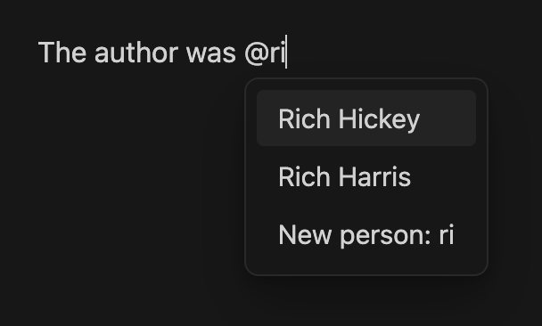

# Obsidian Plugin > GTD Agendas

Obsidian plugin that adds a view to list open task items grouped by tags.

This adds an icon in the sidebar, which opens a new view.



The motivation is to be able to quickly see what people (or meetings) have open tasks.

## Options

There are a few options to configure, primarily what tags and tasks the plugin should consider.

For example, some people use this syntax to note tasks "in progress":

```
- [/] Read the "Lord of the Rings" series.
```

## License

Published and made available freely under the [Very Open License](http://veryopenlicense.com/).
